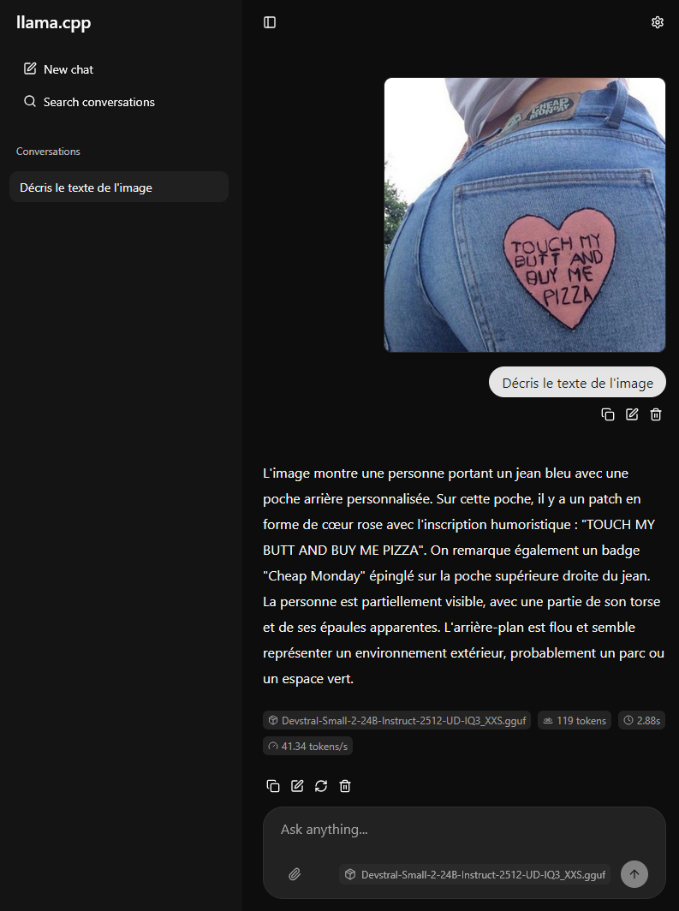

# :bulb: Devstral-small-2 in the pocket

Vous aimez Mistrai parce que vous les trouvez jeunes, cool, sympathiques ?   
(et français ?)

Oui mais voilà !   
Imaginez que des personnes mals avisées espionnent tout ce que vous écrivez dans l'IA

WTF?!  
Comment faire pour continuer à utiliser son IA préférée en toute confidentialité quand des pirates, des men-in-the-middle, des intégristes, des terroristes, l'Etat, l'Europe, les Russes, les Chinois, les Anglais, les Allemands, les Américains vous surveillent ?    

Vous ne connaissez rien aux conteneurs, à docker, les machines virtuelles et vous ne voulez pas vous embêter avec tout ce charabia ?

La Solution est là !  
La Solution c'est Devstral-small-2 in the pocket !

Comment ça marche ?  
C'est simple, en embarque tout dans la poche !

- [Devstral-small-2](https://huggingface.co/unsloth/Devstral-Small-2-24B-Instruct-2512-GGUF/tree/main "Devstral-small-2")
- [llama.cpp](https://github.com/ggml-org/llama.cpp "llama.cpp")
- [Python](https://www.python.org/ "Python")

On embarque tout ça d'un coup et sans installation !

## 📸 Illustration

## Installation facile pour les nuls

### Étapes d'installation

1. **On télécharge et on dézippe le dépôt et on va dans le répèrtoire téléchargé** :

    - :file_folder: [Télécharger la version (v1.0.0)](https://github.com/ycFreddy/Devstral-small-2-embeded/releases/download/v1.0.0/Devstral-small-2-embeded-v1.0.0.zip)
    
    
2. **On télécharge les modèles .gguf que l'on souhaite sans oublier le .mmproj et on les mets dans le dossier   
    "*/models/mistralai"*** :        
    - :file_folder: [Devstral-small-2-gguf](https://huggingface.co/unsloth/Devstral-Small-2-24B-Instruct-2512-GGUF/tree/main "Devstral-small-2")  
    *(personnellement j'utilise "Devstral-Small-2-24B-Instruct-2512-UD-IQ3_XXS.gguf")*

3. **On lance le programme et son IA préfèrée est là, prête à l'emploi** :  
    - 🖥️ *mistralme.bat*  
       
    *Les fainéants n'ont rien d'autre à faire et ça c'est cool !*

## Fonctionalités

Une fois les modèles téléchargés, vous avez tout d'embarqué

:white_check_mark: Disponible sur votre réseau local  
:white_check_mark: Vous conversez avec l'IA de Mistral avec du texte, des pdf, des images en toute confidentialité et sans la nécessité d'une connexion internet  
:white_check_mark: Vous avez le controle sur vos fils de votre discussion  
:white_check_mark: Portabilité complète, vous pouvez transférer le dossier sur une clef usb, par exemple, utile pour avoir son IA partout, in the pocket !

## Note

  - Fonctionne sous windows
  - GPU Nvidia avec [CUDA Tollkit 13.1](https://developer.nvidia.com/cuda-13-1-0-download-archive "CUDA") recommandé
